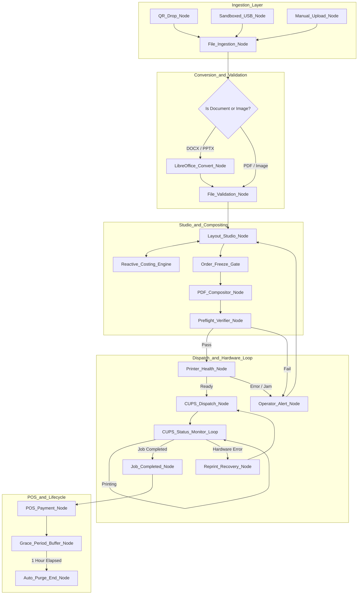

# HomePrint OS — Comprehensive System Design, Graph Architecture & Adversarial Engineering Plan (v4)

> **Project Code**: `home-print`  
> **Target Architecture**: Local-First, Zero-Cloud, High-Performance Micro-App  
> **Hardware Target**: Legacy Asus Laptop (Intel 64-bit, 4GB DDR3L 1600MHz RAM, Single/External Display)  
> **Target Printer**: HP Smart Tank 670 All-in-One (USB 2.0 / Local Wi-Fi IPP, Duplex, Borderless 4R Photo)  
> **Primary Operator**: Family / Non-Technical Operator (Mother) (Visual, drag-and-drop, high-contrast, zero-CLI)  

---

## Table of Contents
1. [Executive Summary & Core Objectives](#1-executive-summary--core-objectives)
2. [Architectural Rationale: Node.js/Fastify vs. Python/FastAPI](#2-architectural-rationale-nodejsfastify-vs-pythonfastapi)
3. [Hardware, Dual-Use Desktop & 4GB RAM Optimization](#3-hardware-dual-use-desktop--4gb-ram-optimization)
4. [The Printing Pipeline & Hardware Driver Verification](#4-the-printing-pipeline--hardware-driver-verification)
   - [4.1 Why the HP Smart App is Bypassed](#41-why-the-hp-smart-app-is-bypassed)
   - [4.2 The Direct CUPS/HPLIP Spooling Pipeline](#42-the-direct-cupshplip-spooling-pipeline)
   - [4.3 Dynamic PPD Option Discovery (Hardware-Verification Dependency)](#43-dynamic-ppd-option-discovery-hardware-verification-dependency)
5. [Document Conversion Pipeline (DOCX, PPTX, PDF for Students & Homework)](#5-document-conversion-pipeline-docx-pptx-pdf-for-students--homework)
6. [Security Posture, Sandboxing & Route-Level PIN Authentication](#6-security-posture-sandboxing--route-level-pin-authentication)
   - [6.1 Route-Level Authentication & LAN Isolation](#61-route-level-authentication--lan-isolation)
   - [6.2 Malware Mitigation: QR Drop vs. Sandboxed USB Hot Folder](#62-malware-mitigation-qr-drop-vs-sandboxed-usb-hot-folder)
7. [Adversarial System Review (Failure Modes, Bottlenecks & Fixes)](#7-adversarial-system-review-failure-modes-bottlenecks--fixes)
8. [Graph Engineering Architecture (Processes as Nodes, Edges & State)](#8-graph-engineering-architecture-processes-as-nodes-edges--state)
   - [8.1 Shared State Schema (`PrintJobState`)](#81-shared-state-schema-printjobstate)
   - [8.2 Complete Node Execution & Transition Matrix](#82-complete-node-execution--transition-matrix)
   - [8.3 The Real-Time CUPS Status Feedback Loop & Error Recovery](#83-the-real-time-cups-status-feedback-loop--error-recovery)
   - [8.4 Gated Purge Lifecycle & One-Click Reprint Resilience](#84-gated-purge-lifecycle--one-click-reprint-resilience)
   - [8.5 Reactive Costing Engine & Order Lock Gate](#85-reactive-costing-engine--order-lock-gate)
9. [Mathematical Model for Layout Crop Coordinates & DPI Qualification](#9-mathematical-model-for-layout-crop-coordinates--dpi-qualification)
   - [9.1 Viewport-to-Physical Coordinate Transformation](#91-viewport-to-physical-coordinate-transformation)
   - [9.2 Operator-Friendly DPI Traffic Light & Guidance](#92-operator-friendly-dpi-traffic-light--guidance)
10. [State Synchronization Protocol (Pinia & WebSockets)](#10-state-synchronization-protocol-pinia--websockets)
11. [Feature Scaffolding & Specifications](#11-feature-scaffolding--specifications)
    - [11.1 Layout Studio (Rush ID, Polaroid, Free Layout)](#111-layout-studio-rush-id-polaroid-free-layout)
    - [11.2 Advanced Costing & Margin Matrix Engine](#112-advanced-costing--margin-matrix-engine)
    - [11.3 Cash POS & Daily Revenue Analytics](#113-cash-pos--daily-revenue-analytics)
12. [Codebase Scaffolding & Directory Structure](#12-codebase-scaffolding--directory-structure)
13. [Implementation Milestones & Execution Roadmap](#13-implementation-milestones--execution-roadmap)

---

## 1. Executive Summary & Core Objectives

Commercial SaaS printing platforms (such as **PrintBoss**) charge recurring subscription fees, require active internet connections, and transmit private customer documents to cloud servers. Conversely, consumer printer software (such as the **HP Smart App**) lacks essential print shop capabilities (such as multi-photo ID tiling, passport dimension grids, scissor cut lines, costing matrices, and cash POS change calculators) while adding latency, account requirements, and driver bloat.

**HomePrint OS** is an adversarial-tested, **100% local-first, zero-subscription web application** engineered specifically for neighborhood print shops operating on low-spec hardware (an old Asus laptop with 4GB RAM) and an **HP Smart Tank 670 All-in-One**.

```
┌─────────────────────────────────────────────────────────────────────────────┐
│                            HOMEPRINT OS ECOSYSTEM                           │
│                                                                             │
│   [Customer Phone]          [Mother's Tablet/Phone]      [Shop Laptop UI]   │
│   (Counter QR Drop)         (Wireless Job Dispatch)     (Main Operator Bar) │
│          │                             │                         │          │
│          │ Public Scope (/drop)        │ Authenticated PIN (/)   │          │
│          └─────────────────────────────┼─────────────────────────┘          │
│                                        │ HTTP / WebSocket (LAN)             │
│                                        ▼                                    │
│                     ┌────────────────────────────────────┐                  │
│                     │  Local Web Server (Fastify + Vite) │                  │
│                     │  • Visual Layout Studio (Konva.js) │                  │
│                     │  • Headless LibreOffice Converter  │                  │
│                     │  • Reactive Costing Matrix Engine  │                  │
│                     │  • Vector 300 DPI PDF Engine       │                  │
│                     │  • SQLite (WAL Mode) Database      │                  │
│                     └──────────────────┬─────────────────┘                  │
│                                        │ Direct Spool & Bidirectional Poll  │
│                                        ▼                                    │
│                     ┌────────────────────────────────────┐                  │
│                     │  CUPS + HPLIP Native Driver Layer  │                  │
│                     └──────────────────┬─────────────────┘                  │
│                                        │ USB 2.0 / IPP                      │
│                                        ▼                                    │
│                     ┌────────────────────────────────────┐                  │
│                     │      HP Smart Tank 670 Printer     │                  │
│                     └────────────────────────────────────┘                  │
└─────────────────────────────────────────────────────────────────────────────┘
```

---

## 2. Architectural Rationale: Node.js/Fastify vs. Python/FastAPI

Earlier iterations explored Python/FastAPI. The transition to **Node.js (Fastify) + TypeScript** was made based on strict memory and maintainability trade-offs for 4GB RAM environments:

| Evaluation Dimension | Python (FastAPI + Gunicorn/Uvicorn) | Node.js (Fastify + TypeScript) | Decision Rationale |
| :--- | :--- | :--- | :--- |
| **Idle Memory Footprint** | ~120MB–180MB (multi-worker overhead) | **~35MB–50MB** | **Fastify wins**: Saves ~100MB of critical RAM on 4GB DDR3L. |
| **Type Safety & Schema Sharing** | Python Pydantic $\leftrightarrow$ TS Frontend (Requires codegen) | **End-to-End TypeScript** | **Fastify wins**: Single type schema shared between Vue 3 canvas and backend PDF builder. |
| **High-Res 2D Vector Compositing** | `reportlab` / `fpdf2` (Cumbersome coordinate API) | **`pdf-lib` + `sharp` (libvips C++ bindings)** | **Fastify wins**: Native streaming buffer manipulation without spiking RAM. |
| **Document Conversion (DOCX/PPTX)**| `unoconv` (Python bridge, notorious memory leaks) | **Direct CLI invocation of `soffice` with sandbox** | **Fastify wins**: Ephemeral process execution; memory reclaimed immediately on exit. |
| **Real-Time WebSocket Spooling** | Starlette WebSockets (Requires async loop tuning) | **`@fastify/websocket` (Native libuv event loop)** | **Fastify wins**: Near-zero latency CUPS queue telemetry. |

---

## 3. Hardware, Dual-Use Desktop & 4GB RAM Optimization

### 3.1 Hardware Baseline
* **CPU**: Dual-Core Intel (e.g. Core i3/i5 3rd/4th Gen or Celeron/Pentium).
* **RAM**: 4GB DDR3L 1600MHz.
* **Display Status**: Hardware display fault (used with external HDMI monitor or run headless / local server).
* **Storage**: Recommended 120GB/240GB 2.5" SATA SSD.

### 3.2 Operating System: **Linux Mint 21.3 XFCE**
* **Base Footprint**: Uses only **~350MB–380MB RAM** at idle.
* **Display Management**: Using `xfce4-display-settings`, disable the broken internal panel (`LVDS-1` or `eDP-1` set to `Off`) and set the HDMI external display as Primary.

### 3.3 Dual-Use Configuration (Shop Mode vs. Presentations)
The machine is dual-use (print shop + school/work presentations). **Kiosk mode is therefore NOT set as a system-level boot default.**
* **Default Setup**: Standard XFCE Desktop. LibreOffice Impress is accessible for presentations.
* **Shop Launchers**:
  * Desktop shortcut *"HomePrint Shop"* opens the web app in a dedicated Chromium application window (`chromium --app=http://localhost:5000`).
  * An optional script `scripts/run-kiosk.sh` is provided if the user explicitly wants an locked fullscreen interface.

---

## 4. The Printing Pipeline & Hardware Driver Verification

### 4.1 Why the HP Smart App is Bypassed
The HP Smart App is bypassed because it cannot arrange multiple ID photos into standard 4R/A4 cut grids, forces cloud authentication, and adds latency.

### 4.2 The Direct CUPS/HPLIP Spooling Pipeline
1. The operator arranges photos or selects document page ranges in the browser.
2. The backend generates a 300 DPI vector PDF.
3. The backend dispatches the job directly to CUPS via `lp` or IPP sockets.
4. A dedicated monitoring loop queries CUPS status until physical printing is verified.

### 4.3 Dynamic PPD Option Discovery (Hardware-Verification Dependency)
> [!IMPORTANT]
> CUPS option names (such as grayscale flags and glossy paper media types) vary across HPLIP versions. Hardcoding `-o OutputMode=BlackOnlyGrayscale` can result in silent failures where color ink is burned for B&W documents.

To resolve this dependency deterministically, HomePrint OS incorporates an **Automatic PPD Discovery Service** during startup:

```typescript
// PPD Option Discovery Logic
// Runs at server boot: lpoptions -p HP_Smart_Tank_670 -l
export interface DiscoveredDriverOptions {
  colorModeKey: string;      // e.g. 'ColorModel' | 'OutputMode' | 'HPColorMode' | 'print-color-mode'
  monochromeValue: string;   // e.g. 'Gray' | 'BlackOnly' | 'monochrome'
  colorValue: string;        // e.g. 'RGB' | 'Color' | 'color'
  glossyMediaType: string;   // e.g. 'PhotographicGlossy' | 'Glossy' | 'Photo'
  plainMediaType: string;    // e.g. 'Plain' | 'PlainPaper'
  borderless4RMedia: string; // e.g. 'Custom.4x6in.Borderless' | 'Photo4x6.Borderless'
}
```

The backend parses the active PPD file (`/etc/cups/ppd/HP_Smart_Tank_670.ppd`) and registers the exact supported flags. Additionally, the Settings view includes a **"1-Click Driver Calibration Test"** that prints a $1\text{ inch}$ grayscale swatch so the operator can visually verify ink separation.

---

## 5. Document Conversion Pipeline (DOCX, PPTX, PDF for Students & Homework)

The neighborhood print shop primarily serves students printing homework, assignments, thesis documents, resumes, and official PDF forms. 

```
                                [CUSTOMER DOCUMENT]
                            (DOCX, PPTX, DOC, XLS, PDF)
                                         │
                                         ▼
                         ┌───────────────────────────────┐
                         │   Document Ingestion Route    │
                         └───────────────┬───────────────┘
                                         │
                   ┌─────────────────────┴─────────────────────┐
                   │ (If PDF)                                  │ (If DOCX / PPTX / DOC)
                   ▼                                           ▼
┌─────────────────────────────────────┐     ┌─────────────────────────────────────┐
│       `pdf-lib` Metadata Engine     │     │   Headless LibreOffice Sandbox      │
│ • Extract total page count          │     │   `soffice --headless --convert-to` │
│ • Extract page dimensions           │     │   (Memory max: 256MB, Timeout: 15s) │
└──────────────────┬──────────────────┘     └──────────────────┬──────────────────┘
                   │                                           │ Converted PDF
                   └─────────────────────┬─────────────────────┘
                                         │
                                         ▼
                         ┌───────────────────────────────┐
                         │     Page Analysis Engine      │
                         │ • Fast color vs B&W detection │
                         │ • Page range selector (1-5)   │
                         └───────────────┬───────────────┘
                                         │
                                         ▼
                         ┌───────────────────────────────┐
                         │     Operator Document Bar     │
                         │ [Copies] [Duplex] [B&W/Color] │
                         └───────────────────────────────┘
```

### Conversion Execution & Sandbox Rules:
* Command:
  ```bash
  systemd-run --scope -p MemoryMax=256M -p CPUQuota=60% \
    soffice --headless --convert-to pdf --outdir /tmp/homeprint_converted \
    --norestore --nofirststartwizard --nologo /tmp/homeprint_ingest/homework.docx
  ```
* **Page Count & Color Detection**: The backend parses the PDF page stream. If a page contains only grayscale color operators (`/DeviceGray` or pure equal RGB channels), it is categorized as B&W (₱2.00–₱5.00/page); if it contains color imagery (`/DeviceRGB`), it is categorized as Color (₱10.00–₱15.00/page).
* **Operator Preview**: The operator sees a fast thumbnail grid generated via `pdftoppm -png -r 72 -f 1 -l 10` (first 10 pages).

---

## 6. Security Posture, Sandboxing & Route-Level PIN Authentication

### 6.1 Route-Level Authentication & LAN Isolation
The customer-facing upload portal (`/drop`) and the operator dashboard (`/`) run on the same Fastify server. To eliminate unauthorized access to sales data, pricing settings, and printer controls by customers on the shop Wi-Fi:

```
┌─────────────────────────────────────────────────────────────────────────────┐
│                         FASTIFY ROUTE SECURITY ARCHITECTURE                 │
│                                                                             │
│  [Public Counter Scope]                           [Operator Admin Scope]    │
│  • GET  /drop                                     • GET  / (Dashboard)      │
│  • POST /api/public/upload                        • GET  /studio            │
│  • GET  /api/public/status/:jobId                 • GET  /costing           │
│                                                   • POST /api/operator/*    │
│  ┌───────────────────────────────┐                • WS   /ws/operator       │
│  │ Rate Limited (5 req/min)      │                ┌───────────────────────┐ │
│  │ Max File Size: 50MB           │                │ 4-Digit Operator PIN  │ │
│  │ Sandboxed Multipart Stream    │                │ Session Cookie / JWT  │ │
│  └───────────────────────────────┘                │ Auto-lock on 15m Idle │ │
│                                                   └───────────────────────┘ │
└─────────────────────────────────────────────────────────────────────────────┘
```

* **Operator PIN**: A simple 4-digit PIN (e.g. `1234`) stored as a salted Argon2/bcrypt hash in SQLite.
* **Persistent Session**: The mother's tablet/phone retains a secure HTTP-only session cookie so she does not need to enter the PIN repeatedly during a work shift.

### 6.2 Malware Mitigation: QR Drop vs. Sandboxed USB Hot Folder
To resolve the security contradiction between QR uploads and USB drives:

1. **Zero Native Execution**: The host OS NEVER executes binaries (`.exe`, `.bat`, `.sh`, `.scr`, `.vbs`, macros).
2. **QR Drop as Primary Vector**: Customers upload files directly over HTTP. The server only accepts MIME types: `application/pdf`, `image/jpeg`, `image/png`, `application/vnd.openxmlformats-officedocument.*`.
3. **Sandboxed USB Hot Folder**:
   - If a customer inserts a USB flash drive, Linux automounts it with strict mount flags: `noexec,nosuid,nodev,ro`.
   - The web app displays a sandboxed file browser showing only whitelisted document/photo extensions.
   - Hidden files, autorun scripts, and executable extensions are completely filtered out and never touched.

---

## 7. Adversarial System Review: Failure Modes, Bottlenecks & Fixes

```
┌─────────────────────────────────────────────────────────────────────────────────┐
│                           ADVERSARIAL RISK MATRIX                               │
│                                                                                 │
│   Impact ▲                                                                      │
│          │  [RAM OOM Crash]       [DPI Scale Distortion]   [Printer Hang/Jam]   │
│   HIGH   │                                                                      │
│          │  [Mother UX Confusion] [Power Cut DB Loss]      [Color Shift]        │
│          │                                                                      │
│   MEDIUM │  [Counter Ingest Lag]  [Network IP Drift]       [Browser Print Blur] │
│          │                                                                      │
│   LOW    │  [Temp File Bloat]     [Thermal Throttling]                          │
│          └────────────────────────────────────────────────────────────────────► │
│             LOW                   MEDIUM                   HIGH      Likelihood │
└─────────────────────────────────────────────────────────────────────────────────┘
```

| Failure Mode | Severity | Root Cause | Engineering Solution |
| :--- | :--- | :--- | :--- |
| **Premature File Purge on Jam** | **CRITICAL** | Purging customer file upon cash payment while printer is still spooling. If paper jams, reprint is impossible. | **Gated Purge**: Files are retained in a local cache until CUPS reports `COMPLETED` + a 1-hour grace window expires. Added 1-click **"Reprint"** button. |
| **Circular Costing vs Layout** | **HIGH** | Costing node requiring `layout.copies` before layout runs. | **Reactive Derived State**: Costing recalculates dynamically on every UI change. Order state is formally frozen at the Preflight Gate. |
| **Silent Grayscale Color Burning** | **HIGH** | Unverified CUPS PPD option strings causing B&W jobs to print in color. | **Dynamic PPD Discovery**: Backend introspects `/etc/cups/ppd/` on boot to extract actual supported vendor attributes. |
| **Public Access to Sales Data** | **HIGH** | Counter customers accessing `/` from the QR drop Wi-Fi network. | **Route-Level PIN Protection**: All admin/POS routes require a 4-digit PIN session. Public routes strictly limited to `/drop`. |
| **RAM Exhaustion on 4GB Laptop** | **HIGH** | 300 DPI full-sheet raster buffers in Chromium or backend. | **Dual-Resolution Engine**: 72 DPI screen canvas; streaming vector PDF compilation with `pdf-lib` (<40MB RAM). |
| **DOCX Conversion Memory Spikes** | **MEDIUM** | Heavy LibreOffice instances staying open in RAM. | **Ephemeral Sandbox CLI**: `systemd-run --scope -p MemoryMax=256M` terminates process immediately upon PDF export. |
| **Tablet Wi-Fi Disconnect Desync** | **MEDIUM** | Mother's tablet sleeps mid-job, causing stale UI state. | **State Sync Handshake**: Reconnecting WebSocket sends `SYNC_REQUEST`; server returns full snapshot from SQLite and CUPS. |

---

## 8. Graph Engineering Architecture (Processes as Nodes, Edges & State)



### 8.1 Shared State Schema (`PrintJobState`)
```typescript
export interface PrintJobState {
  jobId: string;
  createdAt: string;
  source: 'QR_DROP' | 'USB_SANDBOX' | 'MANUAL_UI';
  customer: {
    name?: string;
    phone?: string;
  };
  inputFiles: Array<{
    fileId: string;
    originalName: string;
    mimeType: string;
    rawFilePath: string;
    convertedPdfPath?: string;
    pageCount: number;
    colorPages: number[];
    bwPages: number[];
    widthPx?: number;
    heightPx?: number;
    dpiDetected?: number;
    dpiQualityGrade: 'CRISP' | 'ACCEPTABLE' | 'BLURRY';
  }>;
  product: {
    productId: string;
    name: string;
    category: 'RUSH_ID' | 'DOCUMENT' | 'PHOTO' | 'POLAROID' | 'CUSTOM';
    paperSize: '4R' | 'A4' | 'Letter' | 'Legal';
    paperType: 'GLOSSY_PHOTO' | 'MATTE_PHOTO' | 'PLAIN_PAPER';
    isDuplex: boolean;
    colorMode: 'COLOR' | 'MONOCHROME';
  };
  layout: {
    presetId: 'SET_1_RUSH' | 'SET_2_2X2' | 'SET_3_COMBO' | 'SET_4_PASSPORT' | 'POLAROID' | 'FREE' | 'DOC_DEFAULT';
    copies: number;
    pageRange: string; // e.g. "1-5", "all"
    showCutLines: boolean;
    zeroGap: boolean;
    mirrorFlip: boolean;
    cropTransform: {
      scale: number;
      offsetX: number;
      offsetY: number;
    };
    boxes: PhotoBoundingBox[];
  };
  costing: {
    materialCost: number;
    operationCost: number;
    laborCost: number;
    totalBaseCost: number;
    targetMarginPercent: number;
    calculatedPrice: number;
    discount: number;
    finalPrice: number;
    isLocked: boolean;
  };
  preflightVerdict: {
    passed: boolean;
    warnings: string[];
    errors: string[];
    generatedPdfPath?: string;
    generatedPdfSize?: number;
  };
  hardwareState: {
    printerReady: boolean;
    printerStatusText: string;
    cupsJobId?: number;
    cupsJobState: 'PENDING' | 'PROCESSING' | 'COMPLETED' | 'HELD' | 'CANCELED' | 'ABORTED';
    activePage: number;
    totalPages: number;
  };
  payment: {
    status: 'PENDING' | 'PAID';
    cashTendered: number;
    changeDue: number;
    paymentMethod: 'CASH' | 'GCASH';
  };
  lifecycle: {
    reprintCount: number;
    canReprint: boolean;
    purgeScheduledAt?: string;
    isPurged: boolean;
  };
}
```

### 8.2 Complete Node Execution & Transition Matrix

| Node Name | Input State | Operations / Tools | Output State | Error / Loop Route |
| :--- | :--- | :--- | :--- | :--- |
| **`File_Ingestion_Node`** | Upload stream | Saves raw file to `/var/homeprint/ingest/`, generates `jobId`, creates SQLite record | `{ jobId, inputFiles }` | Reject unsupported formats |
| **`LibreOffice_Convert_Node`** | DOCX/PPTX file | Runs sandboxed `soffice --headless --convert-to pdf` | `convertedPdfPath`, `pageCount` | On fail $\to$ Flag error to operator |
| **`File_Validation_Node`** | PDF / Image files | Analyzes DPI, color channels, page counts | `dpiQualityGrade`, `colorPages` | Low DPI $\to$ Set warning |
| **`Layout_Studio_Node`** | `layout.presetId`, crop | Computes physical bounding boxes in mm | `layout.boxes` | User adjusts on canvas |
| **`Reactive_Costing_Engine`** | Product, copies, labor | Reactive formula recalculating base cost and margin matrix | `costing` updated live | None (deterministic) |
| **`Order_Freeze_Gate`** | Layout + Costing | Locks order parameters, marks `costing.isLocked = true` | Immutable order snapshot | If invalid $\to$ Return to Studio |
| **`PDF_Compositor_Node`** | Photo stream / Doc PDF | `pdf-lib` compiles vector 300 DPI PDF with cut lines | `generatedPdfPath` | Render error $\to$ Operator Alert |
| **`Preflight_Verifier_Node`** | Generated PDF | Verifies file size, page count, and dimensions | `preflightVerdict.passed = true` | Page mismatch $\to$ Loop to Compositor |
| **`Printer_Health_Node`** | OS CUPS state | Queries `lpstat` and PPD driver status | `printerReady = true` | Paper empty/Offline $\to$ Operator Alert |
| **`CUPS_Dispatch_Node`** | Verified PDF | Dispatches `lp` with discovered PPD options | `cupsJobId`, `cupsJobState = 'PENDING'` | Spool error $\to$ Retry (max 2) |
| **`CUPS_Status_Monitor_Loop`**| `cupsJobId` | Polls CUPS every 2s, pushes WebSocket status to UI | `cupsJobState = 'COMPLETED'` | Jam/Error $\to$ Route to `Reprint_Recovery_Node` |
| **`Reprint_Recovery_Node`** | Failed job | Displays Jam Cleared prompt; 1-click resend of cached PDF | Re-routes to `CUPS_Dispatch_Node` | User can cancel & refund |
| **`POS_Payment_Node`** | Final price, Cash input | Calculates change, marks `PAID`, logs sales tally | `payment.status = 'PAID'` | Cash < Bill $\to$ Block checkout |
| **`Auto_Purge_End_Node`** | Completed job | Waits for 1-hour grace window, deletes raw files | `isPurged = true` | None |

### 8.3 The Real-Time CUPS Status Feedback Loop & Error Recovery
Once `CUPS_Dispatch_Node` spools a job:
1. The **`CUPS_Status_Monitor_Loop`** queries `lpstat -o` and IPP status every 2 seconds.
2. WebSockets push updates to the operator UI:
   - 🔵 **Queued in Printer Memory**
   - 🟣 **Printing Page 1 of 2...**
   - 🟢 **Print Completed Successfully** (Plays cheerful chime)
3. **If a Jam or Out-Of-Paper occurs**:
   - CUPS flags `printer-state-reasons=media-empty-warning` or `media-jam`.
   - UI flashes a large yellow/red banner with voice/tone prompt: *"Paper Jam Detected. Please clear paper."*
   - Once cleared, the operator taps **[Resume / Reprint]** $\to$ re-dispatches the cached PDF.

### 8.4 Gated Purge Lifecycle & One-Click Reprint Resilience
* Files are **NEVER purged immediately upon payment**.
* The generated PDF and source images remain in `/var/homeprint/cache/` during a **1-Hour Grace Period**.
* If a customer drops their photo in coffee or notices a smudge before leaving the shop, the mother taps **"Reprint Job"** with a single touch, charging a discounted reprint fee without asking the customer to resend the photo.

---

## 9. Mathematical Model for Layout Crop Coordinates & DPI Qualification

### 9.1 Viewport-to-Physical Coordinate Transformation
To ensure that a photo cropped on screen matches the exact physical passport dimensions ($2\times 2\text{ in}$ or $35\times 45\text{ mm}$) at 300 DPI without pixel shift:

Let:
* $(W_{img}, H_{img})$ = Original image dimensions in pixels.
* $(W_{canvas}, H_{canvas})$ = On-screen canvas container in CSS pixels.
* $(S, O_x, O_y)$ = Operator's zoom scale and pan offsets in canvas space.
* $(W_{box\_mm}, H_{box\_mm})$ = Physical target dimensions on paper in millimeters.
* $R_{target} = 300\text{ DPI} \approx 11.811\text{ pixels/mm}$.

The pixel extraction crop rectangle from the original image is calculated as:
$$x_{src} = \frac{-O_x}{S} \times \left(\frac{W_{img}}{W_{canvas}}\right)$$
$$y_{src} = \frac{-O_y}{S} \times \left(\frac{H_{img}}{H_{canvas}}\right)$$
$$w_{src} = \frac{W_{box\_canvas}}{S} \times \left(\frac{W_{img}}{W_{canvas}}\right)$$
$$h_{src} = \frac{H_{box\_canvas}}{S} \times \left(\frac{H_{img}}{H_{canvas}}\right)$$

In PostScript PDF points ($1\text{ mm} = \frac{72}{25.4}\text{ pt}$):
$$w_{pdf\_pt} = W_{box\_mm} \times \frac{72}{25.4}$$
$$h_{pdf\_pt} = H_{box\_mm} \times \frac{72}{25.4}$$
$$x_{pdf\_pt} = X_{box\_mm} \times \frac{72}{25.4}$$
$$y_{pdf\_pt} = \left(\text{PageHeight}_{mm} - (Y_{box\_mm} + H_{box\_mm})\right) \times \frac{72}{25.4}$$

### 9.2 Operator-Friendly DPI Traffic Light & Guidance
When a customer sends a photo via WhatsApp or Messenger, it is heavily compressed. The UI provides simple, human-friendly guidance for the mother:

$$\text{Effective DPI} = \frac{\min(w_{src}, h_{src})}{\left(\frac{W_{box\_mm}}{25.4}\right)}$$

* 🟢 **Crisp & Clear** ($\text{DPI} \ge 250$): Full green badge. Perfect for official visa/passport prints.
* 🟡 **Acceptable Quality** ($150 \le \text{DPI} < 250$): Orange badge. Notice: *"Sent via Messenger/WhatsApp. OK for student ID, but slightly soft."*
* 🔴 **Too Blurry** ($\text{DPI} < 150$): Red badge with alert modal: *"Photo is too small/blurry. Please ask customer to upload original file via Counter QR code."*

---

## 10. State Synchronization Protocol (Pinia & WebSockets)

To prevent the mother's tablet from desynchronizing after sleep mode or a Wi-Fi blip:

```
[Mother's Tablet Wakes Up / Reconnects]
                 │
                 ▼
[Client sends WebSocket handshake: { type: 'SYNC_REQUEST', lastEventId: 42 }]
                 │
                 ▼
[Server queries SQLite & CUPS Spooler]
                 │
                 ▼
[Server returns: {
    type: 'STATE_SNAPSHOT',
    activeJobs: [...],
    printerStatus: { ready: true, state: 'idle' },
    dailyTally: { revenue: 450.00, jobsCompleted: 12 }
}]
                 │
                 ▼
[Pinia Store atomically replaces local state with server truth]
```

---

## 11. Feature Scaffolding & Specifications

### 11.1 Layout Studio (Rush ID, Polaroid, Free Layout)
* **Preset Library (Standard 4R Sheet: $101.6 \times 152.4\text{ mm}$)**:
  * **Set 1**: $4\text{ pcs } 2\times 2" + 8\text{ pcs } 1\times 1"$ (Standard Rush ID Package).
  * **Set 2**: $6\text{ pcs } 2\times 2"$ (Visa / PRC).
  * **Set 3**: $6\text{ pcs } 1.5\times 1.5" + 4\text{ pcs } 1\times 1"$ (Combo Package).
  * **Set 4**: $6\text{ pcs } 35\times 45\text{ mm}$ (Passport Specification).
  * **Polaroid Mini**: $2\times 3"$ with customizable text footer.
* **Studio Controls**:
  * Scissor cut line toggle (dashed $0.5\text{pt}$ lines).
  * Zero-gap toggle (eliminates padding for fast guillotine cuts).
  * Sublimation mirror-flip toggle.
  * 1-click Auto-Arrange & Fill Page.

### 11.2 Advanced Costing & Margin Matrix Engine
$$\text{Base Cost} = \sum \text{Material} + \sum \text{Operation} + \left(\frac{\text{Labor Rate/hr}}{60} \times \text{Labor Minutes}\right)$$
* **Material Items**: Glossy 230gsm photo paper (₱2.50), Plain A4 (₱0.50), Laminating pouch (₱3.00).
* **Operation Items**: Electricity (₱1.00), Ink consumption (₱3.50 color / ₱0.50 B&W), Maintenance reserve (₱2.00).
* **Margin Matrix**: Real-time calculated table for 25%, 50%, 75%, 100%, 150% markups.
* **Target Margin Slider**: 10% to 200% dynamic selling price slider.
* **Bulk Calculator**: $(\text{Price} \times \text{Qty}) - \text{Discount} = \text{Total}$.

### 11.3 Cash POS & Daily Revenue Analytics
* **Large POS Drawer**: Bill amount, quick cash buttons (`₱50`, `₱100`, `₱500`, `₱1000`, `Exact`), giant green change indicator.
* **Daily Financials**: Total Gross Sales (₱), Net Estimated Profit (₱), Breakdown by category (ID Photos, Documents, Photo Prints).

---

## 12. Codebase Scaffolding & Directory Structure

```
home-print/
├── backend/
│   ├── src/
│   │   ├── config/              # App, auth & dynamic printer PPD config
│   │   │   ├── printer.config.ts
│   │   │   └── auth.config.ts
│   │   ├── db/                  # SQLite database & migrations (WAL Mode)
│   │   │   ├── schema.sql
│   │   │   └── database.ts
│   │   ├── nodes/               # Graph Engineering Nodes
│   │   │   ├── types.ts
│   │   │   ├── ingestion.node.ts
│   │   │   ├── libreoffice-convert.node.ts
│   │   │   ├── validation.node.ts
│   │   │   ├── studio.node.ts
│   │   │   ├── compositor.node.ts
│   │   │   ├── preflight.node.ts
│   │   │   ├── printer-health.node.ts
│   │   │   ├── cups-dispatch.node.ts
│   │   │   ├── cups-monitor.node.ts
│   │   │   └── purge.node.ts
│   │   ├── routes/              # Public vs Authenticated Operator Endpoints
│   │   │   ├── public-drop.routes.ts
│   │   │   ├── operator-jobs.routes.ts
│   │   │   ├── operator-costing.routes.ts
│   │   │   ├── operator-print.routes.ts
│   │   │   └── operator-auth.routes.ts
│   │   ├── services/            # Core business logic
│   │   │   ├── pdf-builder.service.ts
│   │   │   ├── cups-driver.service.ts
│   │   │   ├── ppd-discovery.service.ts
│   │   │   ├── document-converter.service.ts
│   │   │   └── costing-calculator.service.ts
│   │   └── server.ts            # Fastify Server & WebSocket Hub
│   ├── package.json
│   └── tsconfig.json
│
├── frontend/
│   ├── src/
│   │   ├── assets/              # Sounds (chime.mp3, alert.mp3), icons
│   │   ├── components/
│   │   │   ├── dashboard/       # Queue, printer health banner, daily stats
│   │   │   ├── layout-studio/   # Canvas editor, preset cards, DPI traffic light
│   │   │   ├── document-view/   # Document page range selector, B&W/Color toggle
│   │   │   ├── costing/         # Material/Labor inputs, margin matrix
│   │   │   ├── pos/             # Big cash buttons, change display
│   │   │   └── common/          # PIN Lock Modal, large buttons
│   │   ├── stores/              # Pinia state stores with WebSocket sync
│   │   │   ├── jobStore.ts
│   │   │   ├── layoutStore.ts
│   │   │   ├── costingStore.ts
│   │   │   └── authStore.ts
│   │   ├── views/
│   │   │   ├── DashboardView.vue
│   │   │   ├── LayoutStudioView.vue
│   │   │   ├── DocumentPrintView.vue
│   │   │   ├── CostingView.vue
│   │   │   ├── InactiveUploadView.vue # Counter QR Drop portal (/drop)
│   │   │   └── SettingsView.vue
│   │   ├── App.vue
│   │   └── main.ts
│   ├── package.json
│   ├── vite.config.ts
│   └── tailwind.config.js
│
├── scripts/
│   ├── setup-linux-cups.sh      # Automated CUPS, HPLIP & LibreOffice installer
│   ├── run-shop.sh              # Standard non-intrusive shop launch script
│   ├── run-shop-kiosk.sh        # Optional dedicated kiosk launch script
│   └── backup-db.sh             # Daily SQLite snapshot script
│
└── print-implementation_plan.md # Permanent architecture & design reference
```

---

## 13. Implementation Milestones & Execution Roadmap

```
┌─────────────────────────────────────────────────────────────────────────────┐
│                        DEVELOPMENT ROADMAP PHASES                           │
│                                                                             │
│  [Phase 1] Backend Core, Auth & CUPS PPD Discovery ............... Days 1-3 │
│  [Phase 2] Document Converter (DOCX/PDF) & 300DPI Studio ......... Days 4-7 │
│  [Phase 3] Reactive Costing, Cash POS & Margin Matrix ............ Days 8-10│
│  [Phase 4] Public QR Drop Portal & Sandboxed USB Hot Folder ...... Days 11-13│
│  [Phase 5] Hardware Tuning, Calibration & Mother Usability Trial . Days 14-15│
└─────────────────────────────────────────────────────────────────────────────┘
```

* **Phase 1: Backend Core, Auth & CUPS PPD Discovery**
  - Scaffold Fastify + SQLite database with WAL mode.
  - Implement PIN session authentication and route separation (`/drop` vs `/`).
  - Implement `ppd-discovery.service.ts` and dynamic `lpoptions` inspector.

* **Phase 2: Document Converter & Layout Studio**
  - Implement headless LibreOffice conversion sandbox for DOCX/PPTX.
  - Build Vue 3 + Konva canvas with 4R presets, scissor lines, zero gap, and DPI traffic light.
  - Build `pdf-builder.service.ts` using `pdf-lib` for exact 300 DPI vector PDFs.

* **Phase 3: Reactive Costing & Cash POS**
  - Implement reactive costing formulas (Material + Operation + Labor).
  - Implement Margin Matrix (25%, 50%, 75%, 100%, 150%) and Target Price slider.
  - Build Cash POS drawer with quick cash tender buttons and giant change display.

* **Phase 4: Public QR Drop Portal & Sandboxed USB Hot Folder**
  - Build customer-facing mobile upload page at `/drop`.
  - Generate printable shop Wi-Fi counter QR code.
  - Implement sandboxed, read-only USB file browser.

* **Phase 5: Hardware Tuning & Usability Trial**
  - Install Linux Mint 21 XFCE on the Asus laptop.
  - Run the 1-Click Driver Calibration Test on the HP Smart Tank 670.
  - Conduct full end-to-end usability testing with mother; optimize touch targets and eliminate friction.
